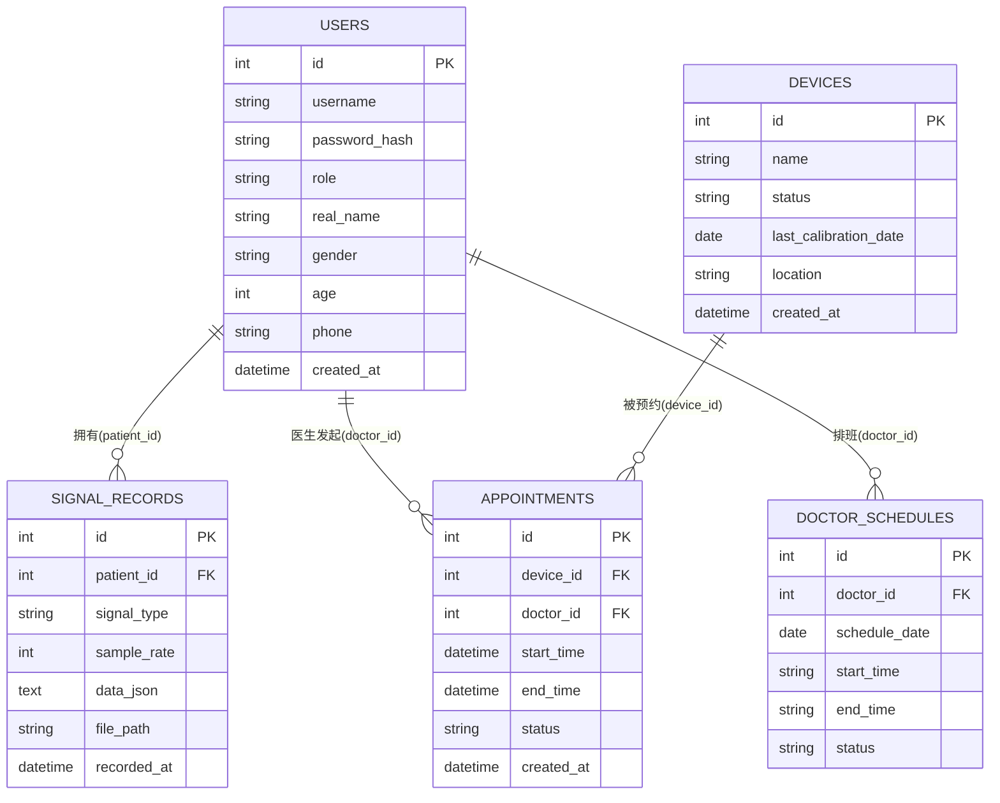

# Mini BME-Hub 设计简报

## 1. 项目概述

医疗设备管理简易平台（Mini BME-Hub）：患者查看本人生理信号与医生出诊时间，医生调阅患者信息、管理设备台账并预约设备，管理员统一管理用户与设备物资。系统采用前后端分离架构，前端 Vue3，后端 Flask 三层架构，数据库 SQLite。

## 2. E-R 图

## 3. 数据库表设计

| 表 | 说明 | 关键字段 |
|---|---|---|
| `users` | 用户（患者/医生/管理员） | id、username、password_hash、role、real_name、gender、age、phone、created_at |
| `devices` | 医疗设备台账 | id、name、status(online/fault/calibrating)、last_calibration_date、location、created_at |
| `signal_records` | 生理信号记录 | id、patient_id、signal_type、sample_rate、data_json、file_path、recorded_at |
| `appointments` | 设备预约记录 | id、device_id、doctor_id、start_time、end_time、status、created_at |
| `doctor_schedules` | 医生出诊/空闲排班 | id、doctor_id、schedule_date、start_time、end_time、status |

## 4. 接口设计

| 方法 | 路径 | 权限 | 说明 |
|---|---|---|---|
| POST | `/api/auth/login` | 公开 | 登录，返回 JWT 与用户信息 |
| GET | `/api/auth/me` | 登录用户 | 当前用户信息 |
| GET | `/api/signals/my` | 患者 | 本人生理信号列表 |
| GET | `/api/signals/<id>/waveform` | 患者本人/医生 | 信号波形数值 |
| POST | `/api/signals/upload` | 患者/医生 | 上传 CSV 生理数据 |
| GET | `/api/doctors/schedules` | 患者 | 医生出诊/空闲时间表 |
| GET | `/api/patients` | 医生/管理员 | 患者列表 |
| GET | `/api/patients/<id>/signals` | 医生/管理员 | 患者信息与信号记录 |
| GET | `/api/devices` | 医生/管理员 | 设备台账 |
| PUT | `/api/devices/<id>/status` | 医生/管理员 | 修改设备状态 |
| POST | `/api/appointments` | 医生 | 创建设备预约（校验设备状态与时间冲突） |
| GET | `/api/appointments` | 医生 | 我的预约列表 |
| GET/POST | `/api/users` | 管理员 | 用户查询/新增 |
| PUT/DELETE | `/api/users/<id>` | 管理员 | 用户修改/删除 |
| POST/PUT/DELETE | `/api/devices[/<id>]` | 管理员 | 设备录入/修改/删除 |

完整可交互文档见 Swagger：后端启动后访问 `http://127.0.0.1:5000/apidocs`，截图见 `docs/api-截图/`。

## 5. 角色权限矩阵

| 功能 | 患者 | 医生 | 管理员 |
|---|---|---|---|
| 查看本人信号 | ✅ | - | - |
| 查看医生排班 | ✅ | - | - |
| 调阅患者信息与信号 | - | ✅ | ✅ |
| 查看设备台账 | - | ✅ | ✅ |
| 修改设备状态 | - | ✅ | ✅ |
| 设备预约 | - | ✅ | - |
| 用户管理 | - | - | ✅ |
| 设备录入/删除 | - | - | ✅ |

权限实现：前端按角色渲染菜单与路由守卫，后端 `role_required` 装饰器强制校验，防止越权访问。
